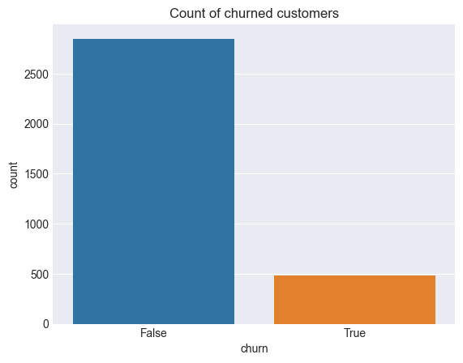
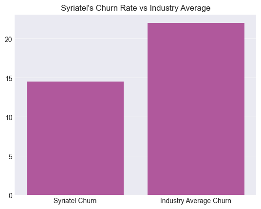
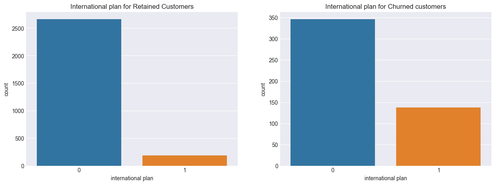
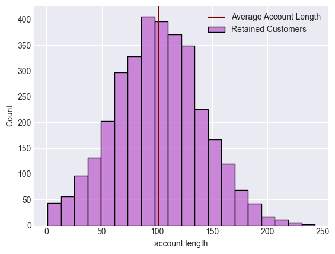
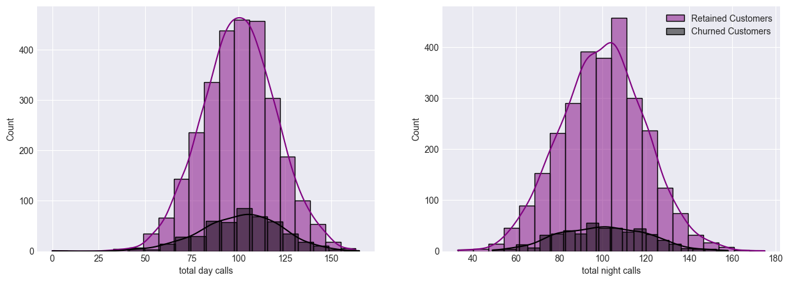

# Churn

# SyriaTel Churn Project.

## Business Understanding.
*SyriaTel, a prominent player in the telecommunications industry, faces a significant challenge in retaining its customer base.
* As customer preferences evolve and competition intensifies, minimizing churn, the departure of customers, becomes essential for maintaining financial stability and sustainable growth. 
* This project seeks to develop an effective predictive model that identifies customers at risk of churning, enabling SyriaTel to implement proactive strategies for customer retention.

## Goals and Objectives.
### Reduce Customer Service Calls.
By analyzing factors contributing to higher customer service call volumes, SyriaTel can proactively address service quality and billing issues, reducing customer frustration and potential churn.

### Maximize Revenue from International Calls.
The churn prediction model can help SyriaTel target customers with substantial international call usage, offering plans or incentives to encourage them to stay and continue using international services.

### Explore Churn Patterns.
Visualize churn rates across different categorical variables (e.g., state, international plan) to identify trends and potential influencing factors.

### Improve Nighttime Service Experience.
Analyze the impact of nighttime call usage on churn and implement measures to enhance nighttime service quality. By understanding the relationship between nighttime call experience and churn, SyriaTel can invest in network improvements and service enhancements during nighttime hours.

## Resource Optimization.
With insights into which customers are more likely to churn, Syriatel can allocate its resources – be it marketing efforts, customer support, or promotional activities – more strategically and efficiently.

## Problem Statement.
* In the dynamic landscape of the telecommunications industry, fierce competition among various companies has become the norm. 
* Syriatel, a prominent player in the telecommunications sector, is not immune to the challenges posed by heightened competition. As a leading provider, Syriatel recognizes the urgency of addressing customer churn head-on. To this end, Syriatel seeks to leverage advanced data analytics and predictive modeling techniques to enhance its customer retention strategies.
* The focus of this project is to create a robust churn prediction model that can anticipate when customers are at risk of churning.
* This predictive tool will serve as a proactive means for Syriatel to take targeted actions, implementing personalized retention initiatives and customer-centric interventions.

## Data Understanding.
In the provided dataset, we have a comprehensive collection of attributes that capture key aspects of customer interactions and behavior within the telecommunications world.
* The dataset encompasses details such:
 ** The customer's geographical location (state).
 ** Account specifics (account length, area code).
 ** Communication preferences (international plan, voice mail plan).
 ** Engagement levels (number of voice mail messages).
* The dataset dives into call usage patterns:
*The duration and charges associated with.
 ** Daytime.
 ** Evening.
 ** Nighttime calls.
 ** International calls.
* The dataset includes information on the number of calls made.
 ** The charges incurred.
 ** The customer service interactions.
* Of particular importance is the binary "churn" indicator, which signifies whether a customer has ceased using SyriaTel's services.
* This dataset offers a comprehensive view of customer behavior, usage patterns and potential churn-related factors, forming the foundation for predictive modeling to anticipate and address customer churn in the telecommunications industry.

## Data Preparation.
* We first import the relevant packages.
* Checking for the shape of the dataframe.
* Identifying missing values.
* Identifying duplicates.
* Checking the data the data types of the columns.
* Checking the columns whose data type is object.
* Converting state column dummies to allow easy processing and dropping the area code column.
* Changing the international plan and voice main plan to 1s and 0s.
* Dropping phone number column as it does not have any connection to churn column.
 ## Data Visualization.
### Visualizing count of churned customers.

From the above graph, roughly 500 customers have churned.
### Total Day Calls of Churned customers vs Retained Customers.
 This observation suggests a positive correlation between call activity and customer retention within the context of SyriaTel's telecommunications services.

### International plans status for both churned and retained customers.

Notable observation is that the proportion of customers with international plans (yes values) is relatively low in both plots – for both churned and retained customers.The low prevalence of international plans among both churned and retained customers suggests that a significant portion of SyriaTel's customer base may not be utilizing international calling services. This could indicate that international calling is not a significant factor influencing customer churn for SyriaTel.

## Data Modeling.
* We first convert the target column to binary.
* Checking to see if there is a class imbalance.
* Splitting to train and test variables.
### Base Modeling.
* Scaling the data.
* instantiating the classifier.
* fitting the model.
* making predictions.
* Getting the f1 score.

As observed from the provided F1 score of 0.36, the model's performance is notably subpar in terms of both precision and recall.
This suggests a lack of effectiveness in correctly identifying positive instances and highlights the potential influence of class imbalance.

As evident from the depicted ROC Curve, the model demonstrates effective performance with an ROC AUC score of 0.83. However, it's important to note that the model faces class imbalance, where the majority class dominates and doesn't churn. Consequently, the model is susceptible to high bias, potentially favoring the majority class in its predictions.
### Performing class balancing.
* using SMOTE
After resampling, our new target has equal number of 0s and 1s. To confirm this here are the value counts.

### Random Forest Model
* This is particularly suitable because it can provide insights into patterns, trends, and factors that contribute to the goals for this project.

Accuracy: 0.94
Classification Report:
               precision    recall  f1-score   support

           0       0.96      0.98      0.97       572
           1       0.86      0.73      0.79        95

    accuracy                           0.94       667
   macro avg       0.91      0.85      0.88       667
weighted avg       0.94      0.94      0.94       667

* Here we perform hyperparameter tuning with GridSearchCV to improve the performance and generalization of your Random Forest model. Which allows us to find the best combination of hyperparameters that can lead to a more accurate and robust model.

Best Parameters: {'max_depth': 20, 'min_samples_leaf': 1, 'min_samples_split': 5, 'n_estimators': 15}

* We do feature importance analysis for understanding and improving our model. It ultimately leads to a more effective and actionable model for your project's objectives.

### Decision Tree Classifier.
* Classifier with default parameters.
Here I built a model with default parameters to assessed it's training and test accuracy.
* instantiating clf.
* fitting the model on resampled data.
* train accuracy and test accuracy.

Training Accuracy = 100.0% and Testing Accuracy = 82.75862068965517%

* From the results above, the training accuracy is at 100% but the test accuracy is at 84%. This clearly shows that the model is overfitting. To solve this, I'll perform hyperparameter tuning using grid search and observe the possible changes.

Tuned classifier and fitted with pipeline.
GridSearchCV(cv=5,
             estimator=Pipeline(steps=[('mms', StandardScaler()),
                                       ('tree',
                                        DecisionTreeClassifier(random_state=42))]),
             param_grid={'tree__criterion': ['gini', 'entropy'],
                         'tree__max_depth': [1, 2, 5, 10],
                         'tree__min_samples_split': [5, 5, 10, 20]},
             scoring='accuracy')

Training Accuracy = 89.3766461808604%
Testing Accuracy = 87.85607196401799%

* From both accuracy scores, the training accuracy reduced from 100% to 88.35% while the test accuracy improved from 84% to 87%. The model is no longer overfitting after hyperparameter tuning with Grid Search.

* These below are the best parameters for the scores provided:
{'tree__criterion': 'gini',
 'tree__max_depth': 10,
 'tree__min_samples_split': 5}

 ### Bagging model.
* We Use Bagging Classifier to build a model that accurately classify churn.
*The accuracy is 0.89 and the f1 score is 0.53.

*As seen with f1 score bagging model has greatly improved from Logistic Regression model but its not performing optimal so we can try improving it with the help GridSearchCV.

Best Parameters: {'max_features': 0.8888888888888888, 'max_samples': 0.7222222222222222, 'n_estimators': 10}
Best Score: 0.9148498710570511
The accuracy of the model is 0.888
The f1 score is 0.497

### XGBoost model.
XGBoost to build a model that can accurately classify churn on the features of the dataset!
* Instantiate the encoder.
* Fit and transform the training data.
* Transform the test data.
* Instantiate XGBClassifier.
* Fit XGBClassifier.
* Predict on training and test sets.
* Accuracy of training and test sets.
Training Accuracy: 100.0%
Testing  accuracy: 95.2%

* Tune our XGBoost model using the grid search methodology.

Grid Search found the following optimal parameters: 
learning_rate: 1
max_depth: 5
n_estimators: 5

Training Accuracy: 96.92%
Testing accuracy: 94.9%