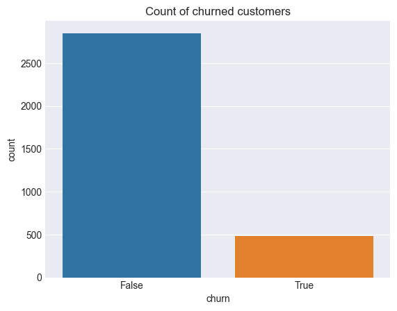
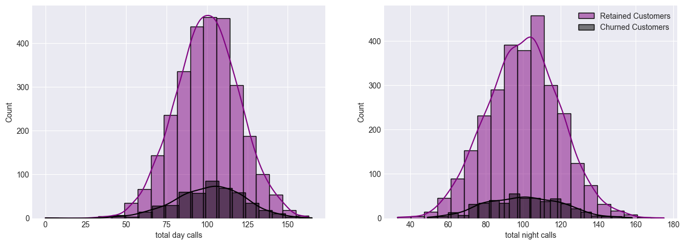
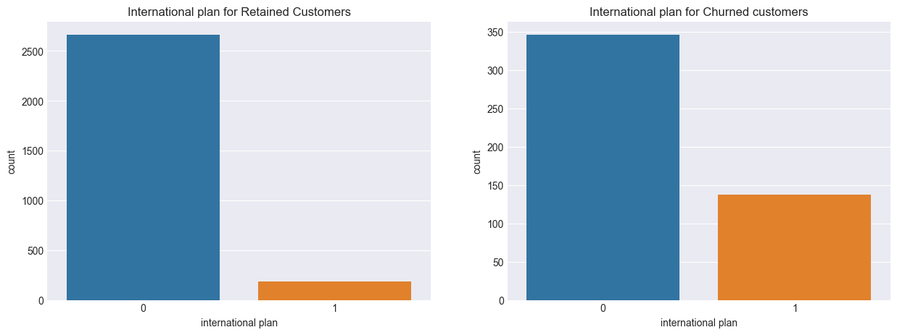
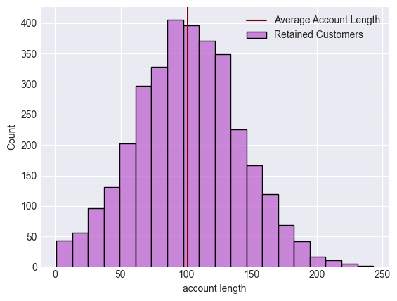
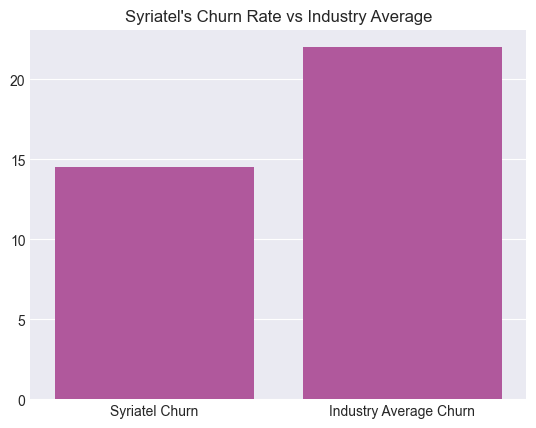
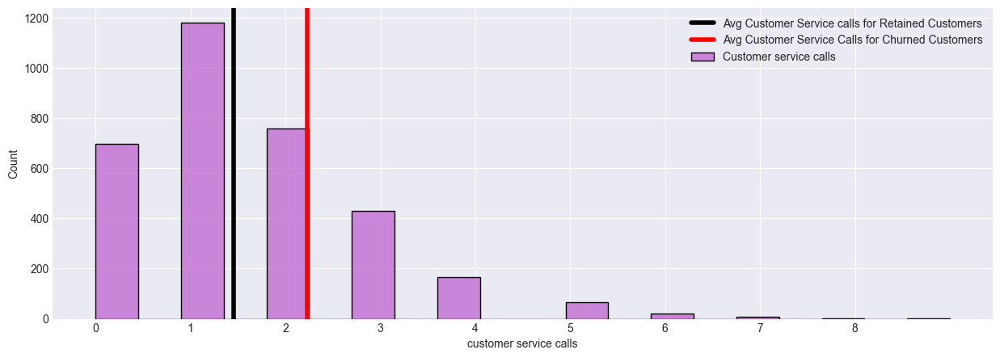
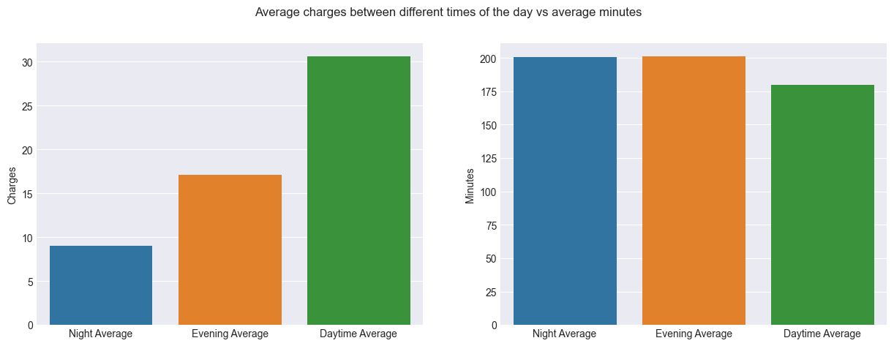
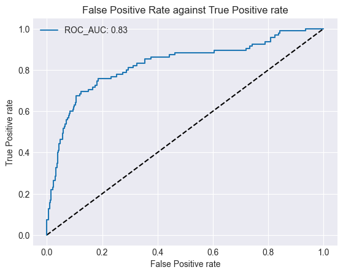
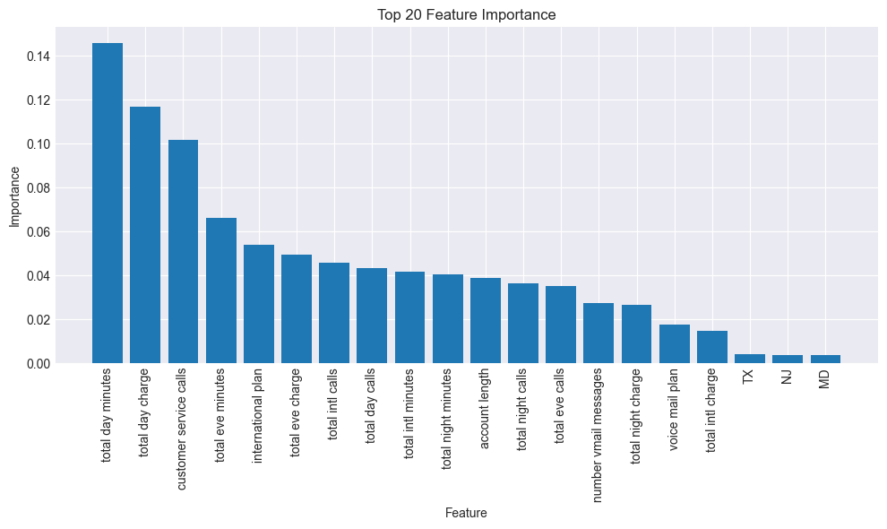
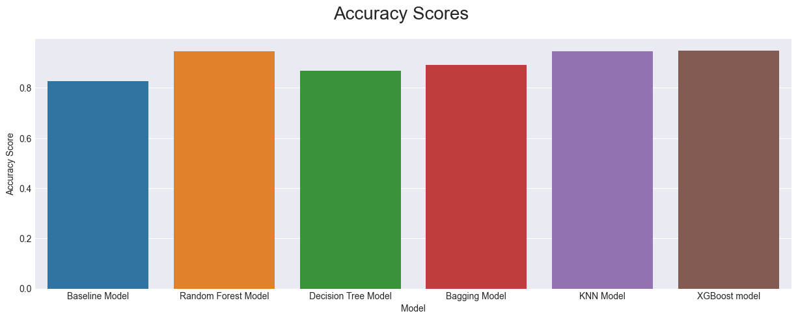

# Churn Prediction for Enhanced Customer Retention
## Project Overview: Customer Churn Prediction for SyriaTel**

In the dynamic telecommunications industry, retaining a satisfied customer base is crucial. For companies like SyriaTel, tackling customer churn (when customers cease services) is vital for financial stability and growth. This project employs advanced data analysis and predictive modeling to create a powerful classifier that identifies potential churn risks. By leveraging this classifier, SyriaTel aims to proactively address customer churn and enhance its service quality.
## Business Understanding

SyriaTel, a leading telecommunications company, must address customer churn to ensure financial stability and growth. This project aims to create a predictive model identifying potential churn risks, empowering SyriaTel to implement preemptive retention strategies.

### Goals and Objectives

1. **Reduce Service Calls:** Address service quality and billing concerns proactively to decrease customer service calls and mitigate churn risk.

2. **Enhance International Revenue:** Target high international call users with retention incentives, maximizing revenue from international services.

3. **Uncover Churn Patterns:** Visualize churn trends across categories for insights into influencing factors.

4. **Nighttime Service Improvement:** Analyze nighttime call impact on churn, enhance service quality during these hours.

5. **Resource Optimization:** Strategically allocate resources based on churn predictions for efficient operations.

### Problem Statement:

- **Telecom Competition**: Intense competition in the telecom industry challenges customer retention.
- **Customer Churn Challenge**: Companies struggle to retain customers amid enticing offers and choices.
- **Syriatel's Initiative**: Syriatel aims to combat churn using predictive analytics.
- **Robust Churn Model**: Project goal is a predictive model for risk of churn.
- **Data-Driven Approach**: Utilizing historical customer data for effective categorization.
- **Proactive Solutions**: Model enables personalized retention actions and interventions.

### Data Understanding:

The dataset comprises vital customer interaction and behavior attributes in the telecom realm. It includes geographic location, account specifics, communication preferences, engagement levels, and call patterns. Data covers call durations, charges, service interactions, and the crucial "churn" indicator. This binary marker signifies service discontinuation. The dataset provides insights into behavior, usage patterns, and potential churn factors. This information forms the basis for predictive modeling to anticipate and mitigate customer churn in the telecom industry.

## Data Preparation
Identifying and handling missing values
Identifying and handling duplicates
Converting state column dummies to allow easy processing and dropping the area code column
Changing the international plan and voice mail plan to 1s and 0s
Dropped phone number column as it does not have any connection to churn column
 ## Data Visualization.
### Visualizing count of churned customers.

From the above graph, roughly 500 customers have churned.
### Total Day Calls of Churned customers vs Retained Customers.
 This observation suggests a positive correlation between call activity and customer retention within the context of SyriaTel's telecommunications services.

### International plans status for both churned and retained customers.

Notable observation is that the proportion of customers with international plans (yes values) is relatively low in both plots – for both churned and retained customers.The low prevalence of international plans among both churned and retained customers suggests that a significant portion of SyriaTel's customer base may not be utilizing international calling services. This could indicate that international calling is not a significant factor influencing customer churn for SyriaTel.

### Average account length of customers

The average account length of approximately 101 suggests that the customer base at Syriatel exhibits a relatively stable relationship with the telecom provider. 

### churned customers

The comparison of churn rates between the industry average and Syriatel reveals intriguing insights. According to [smartlook.com](https://www.smartlook.com/blog/customer-churn-retention/#:~:text=The%20average%20churn%20rate%20in,take%20action%20to%20reduce%20it.), the average churn rate within the industry stands at 22%, contrasting with Syriatel's notably lower churn rate of 14%.
### customer service calls'

### Average charge

The observation that day time has the highest average charge despite having a lower average number of minutes compared to evening and night suggests a potential area of concern that could impact customer churn.
## Data Modeling.
* We first convert the target column to binary.
* Checking to see if there is a class imbalance.
* Splitting to train and test variables.
### Base Modeling.
* Scaling the data.
* instantiating the classifier.
* fitting the model.
* making predictions.
* Getting the f1 score.

As observed from the provided F1 score of 0.36, the model's performance is notably subpar in terms of both precision and recall.
This suggests a lack of effectiveness in correctly identifying positive instances and highlights the potential influence of class imbalance.

As evident from the depicted ROC Curve, the model demonstrates effective performance with an ROC AUC score of 0.83. However, it's important to note that the model faces class imbalance, where the majority class dominates and doesn't churn. Consequently, the model is susceptible to high bias, potentially favoring the majority class in its predictions.
### Performing class balancing.
* using SMOTE
After resampling, our new target has equal number of 0s and 1s. To confirm this here are the value counts.

### Random Forest Model
* This is particularly suitable because it can provide insights into patterns, trends, and factors that contribute to the goals for this project.

Accuracy: 0.94
Classification Report:
               precision    recall  f1-score   support

           0       0.96      0.98      0.97       572
           1       0.86      0.73      0.79        95

    accuracy                           0.94       667
   macro avg       0.91      0.85      0.88       667
weighted avg       0.94      0.94      0.94       667

* Here we perform hyperparameter tuning with GridSearchCV to improve the performance and generalization of your Random Forest model. Which allows us to find the best combination of hyperparameters that can lead to a more accurate and robust model.

Best Parameters: {'max_depth': 20, 'min_samples_leaf': 1, 'min_samples_split': 5, 'n_estimators': 15}

* We do feature importance analysis for understanding and improving our model. It ultimately leads to a more effective and actionable model for your project's objectives.

### Decision Tree Classifier.
* Classifier with default parameters.
Here I built a model with default parameters to assessed it's training and test accuracy.
* instantiating clf.
* fitting the model on resampled data.
* train accuracy and test accuracy.

Training Accuracy = 100.0% and Testing Accuracy = 82.75862068965517%

* From the results above, the training accuracy is at 100% but the test accuracy is at 84%. This clearly shows that the model is overfitting. To solve this, I'll perform hyperparameter tuning using grid search and observe the possible changes.

Tuned classifier and fitted with pipeline.
GridSearchCV(cv=5,
             estimator=Pipeline(steps=[('mms', StandardScaler()),
                                       ('tree',
                                        DecisionTreeClassifier(random_state=42))]),
             param_grid={'tree__criterion': ['gini', 'entropy'],
                         'tree__max_depth': [1, 2, 5, 10],
                         'tree__min_samples_split': [5, 5, 10, 20]},
             scoring='accuracy')

Training Accuracy = 89.3766461808604%
Testing Accuracy = 87.85607196401799%

* From both accuracy scores, the training accuracy reduced from 100% to 88.35% while the test accuracy improved from 84% to 87%. The model is no longer overfitting after hyperparameter tuning with Grid Search.

* These below are the best parameters for the scores provided:
{'tree__criterion': 'gini',
 'tree__max_depth': 10,
 'tree__min_samples_split': 5}

 ### Bagging model.
* We Use Bagging Classifier to build a model that accurately classify churn.
*The accuracy is 0.89 and the f1 score is 0.53.

*As seen with f1 score bagging model has greatly improved from Logistic Regression model but its not performing optimal so we can try improving it with the help GridSearchCV.

Best Parameters: {'max_features': 0.8888888888888888, 'max_samples': 0.7222222222222222, 'n_estimators': 10}
Best Score: 0.9148498710570511
The accuracy of the model is 0.888
The f1 score is 0.497

### KNN Model.
* We will normalize the data and transform the training and test sets.
* We then fit a KNN Model and predict the test set.
* We then evaluate the model checking the precision score, recall score, accuracy score and f1score.

Precision Score: 0.8311391234516828
Recall Score: 0.8620689655172413
Accuracy Score: 0.8620689655172413
F1 Score: 0.814318959787824

### XGBoost model.
XGBoost to build a model that can accurately classify churn on the features of the dataset!
* Instantiate the encoder.
* Fit and transform the training data.
* Transform the test data.
* Instantiate XGBClassifier.
* Fit XGBClassifier.
* Predict on training and test sets.
* Accuracy of training and test sets.
Training Accuracy: 100.0%
Testing  accuracy: 95.2%

* Tune our XGBoost model using the grid search methodology.

Grid Search found the following optimal parameters: 
learning_rate: 1
max_depth: 5
n_estimators: 5

Training Accuracy: 96.92%
Testing accuracy: 94.9%

### Accuracy score

## Conclusion
The best Model was the XGBoost model which showed a high test accuracy and did not overfit the training data.

Why accuracy?
Accuracy provides a quick way to assess the model's general predictive power without delving into the details of true positives, true negatives, false positives, and false negatives.

In conclusion, the predictive modeling efforts aimed at forecasting customer churn for Syriatel have yielded promising results. Among the various models evaluated, the XGBoost model emerged as the most effective, achieving an impressive accuracy rate of approximately 95%. This outcome underscores the potential of utilizing advanced machine learning techniques to accurately identify customers who are likely to churn. By leveraging a rich set of features and employing an ensemble-based approach, the XGBoost model demonstrates its robustness and ability to discern patterns that contribute to churn behavior. 
## Recommendations
**Personalized Customer Engagement:** Utilize the insights gained from the predictive model to personalize customer engagement strategies. Tailored communication, offers, and incentives can be designed to target specific customer segments at risk of churn. By addressing individual needs and concerns, Syriatel can increase customer satisfaction and loyalty.

**Proactive Customer Support:** Leverage the predictive model to proactively identify customers with a higher likelihood of churn and offer them dedicated customer support. Timely intervention through personalized assistance, such as troubleshooting technical issues or addressing service inquiries, can help resolve concerns and improve customer satisfaction.

**Daytime Call Charge Optimization:**  Given the observation that daytime call charges are relatively higher compared to evening and night charges, Syriatel could consider a strategic reduction in daytime call charges. This reduction could be designed to align more closely with the actual average call duration during daytime hours. By offering more competitive and cost-effective daytime call rates, Syriatel can incentivize customers to utilize its services during this period, potentially leading to increased usage and customer retention. Additionally, transparent communication about the reduced charges can enhance customer perception of value, further encouraging loyalty and reducing the likelihood of churn.

## Slides Link
https://www.canva.com/design/DAFrFIAlIUQ/rln3eJIW1mF51ZXBC7NGxg/edit